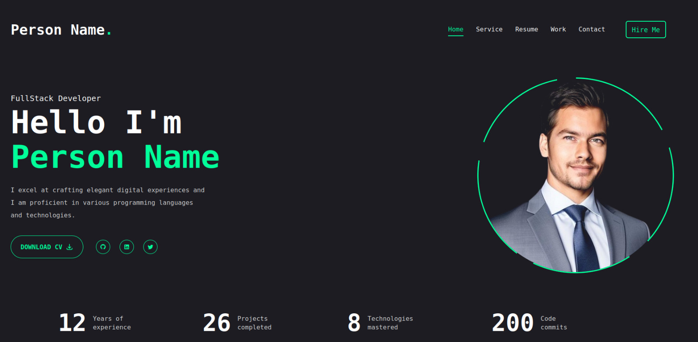

# Go-Vue Portfolio Web


## 📸 Screenshot




Ini adalah aplikasi web portofolio full-stack yang dibuat pakai Go (Gin) untuk backend dan Vue.js (Vite) untuk frontend. Ada juga panel admin buat mengelola konten portofolio secara dinamis.

## 🌟 Fitur

- **Backend Go (Gin):** Backend yang cepat dan andal.
- **Frontend Vue.js (Vite):** UI yang modern dan reaktif.
- **Database SQLite:** Ringan dan mudah di-setup.
- **Otentikasi JWT:** Mengamankan rute admin.
- **Panel Admin:**
  - Kelola konten (CRUD - Create, Read, Update, Delete).
  - Lihat dan hapus pesan dari pengunjung.
  - Unggah file/gambar.
- **Satu Paket:** Server Go langsung menyajikan file frontend yang sudah di-build, jadi aplikasinya bisa jalan sendiri.

## 🛠️ Tumpukan Teknologi

- **Backend:** Go, Gin
- **Frontend:** Vue.js, Vue Router, Vite
- **Database:** SQLite
- **Styling:** CSS Standar

## 🚀 Memulai

Mau coba proyek ini di komputer kamu? Ikuti langkah-langkah di bawah ini ya.

### Prasyarat

- [Go](https://golang.org/doc/install) (versi 1.18 atau lebih baru)
- [Node.js](https://nodejs.org/en/download/) (versi 16 atau lebih baru)
- `npm`

### 1. Backend

Kloning repositori ini:
```bash
git clone https://github.com/mahathirrizky/webportofolio.git
cd webportofolio
```

Bikin file `.env` di folder utama proyek, terus isi variabel ini.
- `SECRET_KEY`: Ini adalah kunci rahasia yang dipakai untuk JWT (JSON Web Token) dan otentikasi admin. Ganti `your-secret-key` dengan string acak yang kuat ya.
- `PORT`: Port tempat server Go akan berjalan.
```
SECRET_KEY=your-secret-key # Ganti dengan kunci rahasia yang kuat
PORT=8080
```

Jalankan server backend-nya:
```bash
go run main.go
```
Server akan berjalan di `http://localhost:8080`.

### 2. Frontend (untuk pengembangan)

Buka terminal baru, terus masuk ke folder `ui`:
```bash
cd ui
```

Instal semua yang dibutuhkan (dependensi):
```bash
npm install
```

Jalankan server frontend untuk pengembangan:
```bash
npm run dev
```
Frontend-nya nanti bisa diakses di `http://localhost:5173` dan otomatis nyambung ke backend Go.

## 📦 Build untuk Produksi

Kalau mau bikin versi produksi (siap pakai) dari aplikasi Vue dan menjalankannya bareng server Go:

1.  **Build aplikasi Vue:**
    ```bash
    cd ui
    npm run build
    ```
    Nanti akan ada folder `dist` di dalam `ui`.

2.  **Jalankan server Go:**
    Dari direktori root, jalankan:
    ```bash
    go run main.go
    ```
    Server Go sekarang akan menyajikan file-file yang sudah di-build dari `ui/dist`. Buka `http://localhost:8080` di browser kamu ya.

## Endpoints API

### Rute Publik
- `GET /api/content`: Ambil semua konten yang bisa dilihat publik.
- `POST /api/messages`: Kirim pesan baru (dari form kontak).

### Rute Admin (memerlukan token JWT)
- `POST /api/auth/login`: Login buat dapat token.
- `GET /api/admin/content`: Ambil semua konten.
- `POST /api/admin/content`: Bikin konten baru.
- `PUT /api/admin/content/:id`: Update konten.
- `DELETE /api/admin/content/:id`: Hapus konten.
- `POST /api/admin/upload`: Upload file.
- `GET /api/admin/messages`: Ambil semua pesan.
- `DELETE /api/admin/messages/:id`: Hapus pesan.

## ❤️ Dukungan

Jika proyek ini berguna bagi Anda, pertimbangkan untuk mentraktir saya kopi!

[](https://www.buymeacoffee.com/mahathirrizky)

## 📄 Lisensi

Proyek ini dilisensikan di bawah Lisensi MIT. Lihat file `LICENSE` untuk detailnya.
